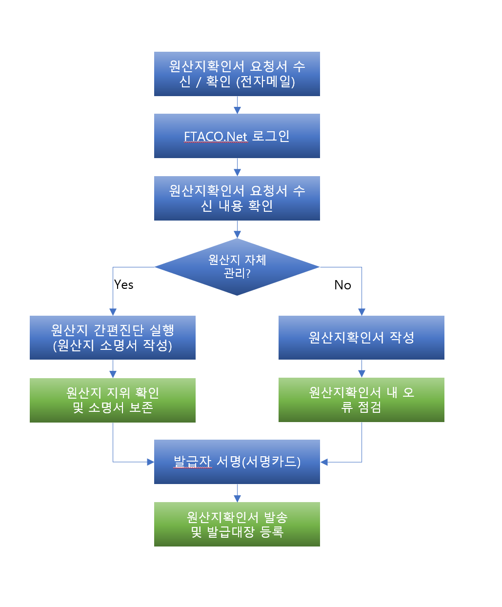

# 원산지관리업무 처리 유형별 사용방법

## 현재 원산지관리시스템을 사용하고 있는 경우 
1. FTACO.Net에서 원산지확인서를 직접 작성합니다. (간편진단 필수 아님)
2. 원산지확인서에 오류가 발견되었다고 표시된 경우 원산지관리자에게 문의, 문제를 해결해야 합니다. 
3. 원산지소명서 등 근거서류 관리는 사용하시는 원산지관리시스템에서 처리해야 합니다.

## 외부 관세법인에 원산지관리를 위탁하고 있는 경우
1. 담당관세사에게 해당 물품의 원산지소명서를 수령, 원산지확인서를 작성하면 됩니다.
2. 담당관세사가 본 서비스를 대신 사용하여 처리하는 경우, 제조기업 담당자에게 연락하여 원산지관리 담당자 정보를 해당 관세사로 변경 요청 후 사용하시면 됩니다.
3. 원산지소명서 등 근거서류 관리는 거래 관세사에게 문의 하십시오.

## 내부에서 원산지관리를 수작업으로 처리하고 있는 경우
1. 원산지확인서 작성 화면에서 품목별로 간편진단 실행 (원산지소명서 자동 작성)
2. 원산지확인서 내용을 확인하고 발행하면 됩니다. 

